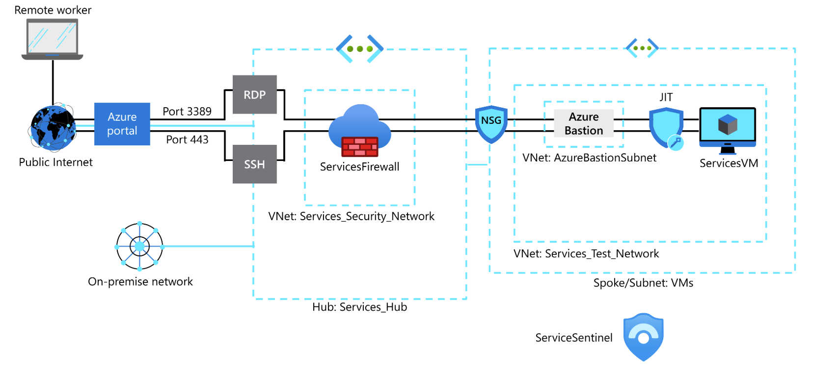

# SecuringVirtualMachines — Project Overview

## summary

Project to deploy a hub-and-spoke Azure network with a Windows VM, Azure Firewall, Bastion host, NSGs and VNet peering to demonstrate secure access and egress control.

## Architecture 

